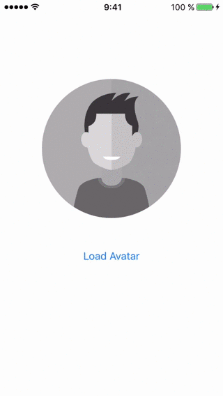

# JDAvatarProgress

[](http://cocoapods.org/pods/JDAvatarProgress)
[](http://cocoapods.org/pods/JDAvatarProgress)
[](http://cocoapods.org/pods/JDAvatarProgress)



## Swift

JDAvatarProgress is available in Swift also

[JDSwiftAvatarProgress](https://github.com/JellyDevelopment/JDSwiftAvatarProgress)

## Usage

To run the example project, clone the repo, and run `pod install` from the Example directory first.

## Installation

### Cocoapod

JDAvatarProgress is available through [CocoaPods](http://cocoapods.org). To install
it, simply add the following line to your Podfile:

```ruby
pod "JDAvatarProgress"
```

### Manual

Clone the repository:

```bash
$ git clone https://github.com/JellyDevelopment/JDAvatarProgress.git
```

Drag and drop `JDAvatarProgress.h` and `JDAvatarProgress.h` files into your project. Add `#import "JDAvatarProgress.h"` to all view controllers that need to use it.

### Requirements
`QuartzCore.framework`

## Sample Usage

```objective-c

[self.avatarImgView setImageWithURL:[NSURL URLWithString:@"http://3.bp.blogspot.com/-k-0O0FocJ2I/TyWbextRGlI/AAAAAAAACqo/GuPx0RH7PcY/s1600/Fondo+Pantalla.jpg"];
```

## Advanced Usage

```objective-c

[self.avatarImgView setImageWithURL:[NSURL URLWithString:@"http://3.bp.blogspot.com/-k-0O0FocJ2I/TyWbextRGlI/AAAAAAAACqo/GuPx0RH7PcY/s1600/Fondo+Pantalla.jpg"]
                        placeholder:nil
                      progressColor:[UIColor orangeColor]
                progressBarLineWidh:JDAvatarDefaultProgressBarLineWidth
                        borderWidth:JDAvatarDefaultBorderWidth
                        borderColor:nil
                         completion:^(UIImage * resultImage, NSError * error){
                             
                             NSLog(@"image => %@", resultImage);
                             NSLog(@"error => %@", error);
                             
                         }];
```

## Author

* [Jelly Development](https://github.com/JellyDevelopment)
 	* Juanpe Catalán, juanpecm@gmail.com
	* David Carrascal, davidlcarrascal@gmail.com

## License

JDAvatarProgress is available under the MIT license. See the LICENSE file for more info.
